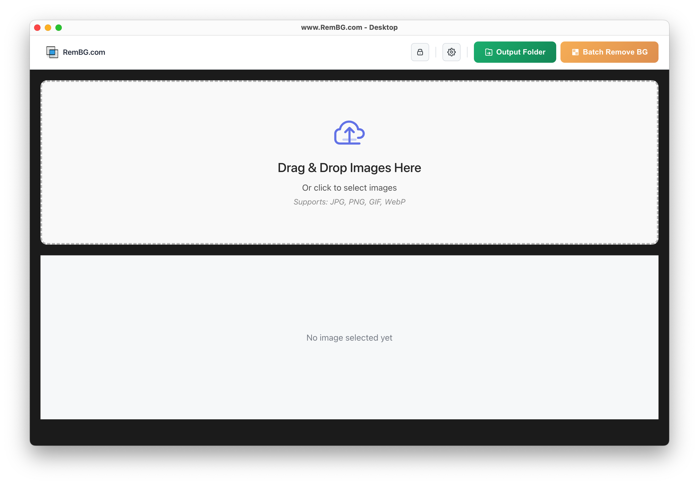

# free-rembg-desktop
RemBG Desktop Application - useful for batch processing and cross-platform GUI

## About the App

RemBG Desktop is a powerful application designed for efficient bulk background removal from images. Leveraging advanced AI technology, it enables users to process large volumes of images simultaneously, significantly reducing the time and effort required for background editing tasks. Perfect for professionals in photography, e-commerce, and marketing who need to handle numerous images consistently.



### Key Features
- **Bulk Processing**: Remove backgrounds from multiple images at once, streamlining workflows for projects involving numerous photos
- **High-Quality Output**: Delivers precise and clean background removal, preserving fine details for professional-grade results
- **User-Friendly Interface**: Designed for accessibility, allowing users of all skill levels to navigate and utilize the application with ease
- **Cross-Platform Support**: Available for Windows, macOS, and Linux, ensuring compatibility across various operating systems
- **Customizable Settings**: Offers options to adjust processing parameters to meet specific project requirements
- **Drag-and-Drop**: Simple interface for uploading multiple images quickly

## Downloads

### Version 1.1.0

#### Linux
- **AppImage (x86_64)**: [RemBG.Desktop-1.1.0.AppImage](https://github.com/Remove-Background-ai/free-rembg-desktop/releases/download/v1.1.0/RemBG.Desktop-1.1.0.AppImage) (109 MB)
  - SHA256: `237b6d802c800eb73c5eb10ac4a34b550e9cee6c3240f70d85add06c4895a6a0`
- **AppImage (ARM64)**: [RemBG.Desktop-1.1.0-arm64.AppImage](https://github.com/Remove-Background-ai/free-rembg-desktop/releases/download/v1.1.0/RemBG.Desktop-1.1.0-arm64.AppImage) (109 MB)
  - SHA256: `edfef0c286a313c5590701f3212e9b3cb016e9fa4e34b2630df36cf366c56d4d`

#### macOS
- **Intel Mac**: [RemBG.Desktop-1.1.0.dmg](https://github.com/Remove-Background-ai/free-rembg-desktop/releases/download/v1.1.0/RemBG.Desktop-1.1.0.dmg) (106 MB)
  - SHA256: `df1f55e78cb45fb21dd04a51fe926f8d25adc26ae0c0d3e6aeb8ee8bf61f16c4`
- **Apple Silicon (M1/M2/M3)**: [RemBG.Desktop-1.1.0-arm64.dmg](https://github.com/Remove-Background-ai/free-rembg-desktop/releases/download/v1.1.0/RemBG.Desktop-1.1.0-arm64.dmg) (100 MB)
  - SHA256: `21078c9315cf02b2081a363747963aa207f679000a4fa308906b6892e8a03ebf`

#### Windows
- **Installer**: [RemBG.Desktop.Setup.1.1.0.exe](https://github.com/Remove-Background-ai/free-rembg-desktop/releases/download/v1.1.0/RemBG.Desktop.Setup.1.1.0.exe) (79.7 MB)
  - SHA256: `e262329ca7e997d13efce7ebe9268919b355d8894aed19cb7be577eab8450e08`

#### Source Code
- **ZIP**: [Source code (zip)](https://github.com/Remove-Background-ai/free-rembg-desktop/archive/refs/tags/v1.1.0.zip)
- **TAR.GZ**: [Source code (tar.gz)](https://github.com/Remove-Background-ai/free-rembg-desktop/archive/refs/tags/v1.1.0.tar.gz)

### Installation Instructions

#### Linux (AppImage)
1. Download the appropriate AppImage for your architecture
2. Make it executable: `chmod +x RemBG.Desktop-1.1.0.AppImage`
3. Run: `./RemBG.Desktop-1.1.0.AppImage`

#### macOS (DMG)
1. Download the appropriate DMG for your Mac (Intel or Apple Silicon)
2. Open the DMG file
3. Drag the application to your Applications folder
4. Launch from Applications or Spotlight

#### Windows (EXE)
1. Download the installer
2. Run the `.exe` file as administrator
3. Follow the installation wizard
4. Launch from Start Menu or Desktop shortcut

### Verifying Downloads

To verify the integrity of your download, compare the SHA256 checksum:

**Linux/macOS:**
```bash
shasum -a 256 /path/to/downloaded/file
```

**Windows (PowerShell):**
```powershell
Get-FileHash -Path "C:\path\to\downloaded\file" -Algorithm SHA256
```

The output should match the SHA256 checksum listed above for your platform.
